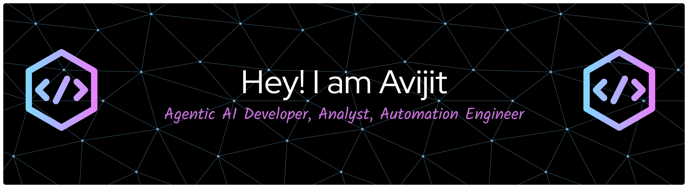

<!--Banner-->

<!--Night Owl image-->

  

<!--Start Intro-->               

I am an Agentic AI Developer, Analyst, and Automation Engineer with strong expertise in Python. I specialize in building intelligent, autonomous systems, leveraging data-driven insights, and designing automation solutions that optimize workflows and enhance efficiency. 

- ✨ Student of life :)
- 💻 Working at DXC Technology.
- ✍ I capture moments from nature, find my artist profile at [COG India](https://cogindia.art/artist_profiles/avijit-pal/).
- ❤ Contributing to Open Source.
<!--End Intro-->

<!--Profile Count Badge-->

  

---

<h3 align="left">Current Learning</h3>
<ul align="left">
  <li>Deepening my knowledge in Agentic AI.</li>
  <li>Exploring advanced PowerApps Models.</li>
</ul>

 
 
 
 

<!--Trophies Section-->   
<h2 align="center">🏆 Gɪᴛʜᴜʙ Tʀᴏᴘʜɪᴇs 🏆</h2>

  <a href="https://github.com/avijit0022/avijit0022">
    <picture>
      <source media="(prefers-color-scheme: dark)" srcset="https://github-profile-trophy.vercel.app/?username=avijit0022&no-bg=true&row=2&column=6&margin-w=20&margin-h=20&theme=monokai">
      <source media="(prefers-color-scheme: light)" srcset="https://github-profile-trophy.vercel.app/?username=avijit0022&no-bg=true&row=2&column=6&margin-w=20&margin-h=20">
    </picture>
  </a>

  

 

<!--Github stats Table--> 
<h2 align="center">📊 Gɪᴛʜᴜʙ Sᴛᴀᴛs 📊</h2>

<table width="100%">
  <tr>
    <td width="50%">
      <h3 align="center"><strong>Gɪᴛʜᴜʙ Sᴛᴀᴛs</strong></h3>
      

        
      

    </td>
    <td width="50%">
      <h3 align="center"><strong>Sᴛʀᴇᴀᴋ Sᴛᴀᴛs</strong></h3>
      

        
      

    </td>
  </tr>
</table>
 

<!--Contribution Graph-->
<h2 align="center">📈 Cᴏɴᴛʀɪʙᴜᴛɪᴏɴ Gʀᴀᴘʜ 📈</h2>

    

---

<!--Dynamic Quote card updates everyday at 12 PM--> 
<h2 align="center">🌟 Tʜᴏᴜɢʜᴛ ᴏғ ᴛʜᴇ Dᴀʏ 🌟</h2>

<!--STARTS_HERE_QUOTE_CARD-->

    

<!--ENDS_HERE_QUOTE_CARD-->

<!--Contact Section--> 

<h2 align="center">🤝 Cᴏɴɴᴇᴄᴛ Wɪᴛʜ Mᴇ 🤝 </h2>

  

 

<!--Buy me a coffee-->

<!--Footer--> 

  

